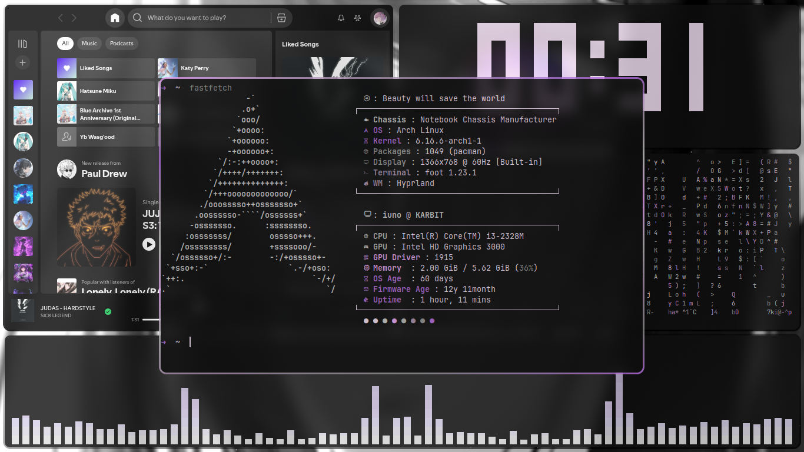
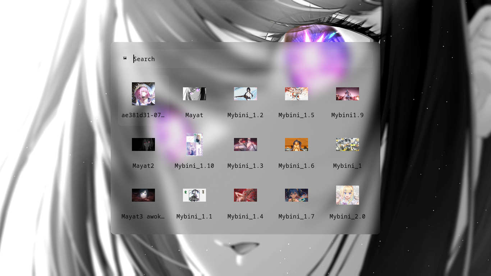
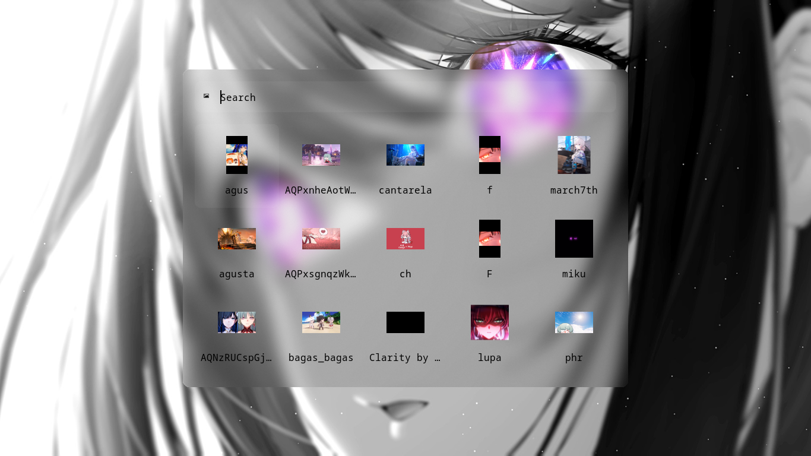
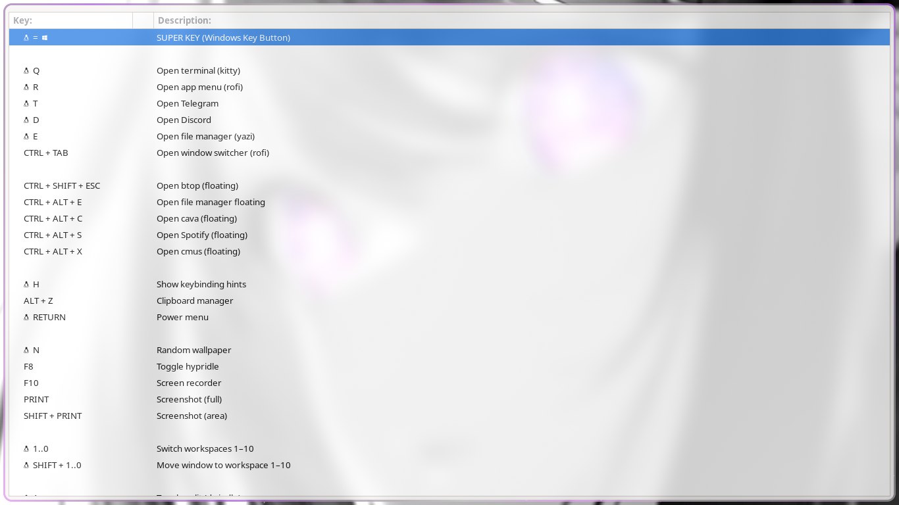
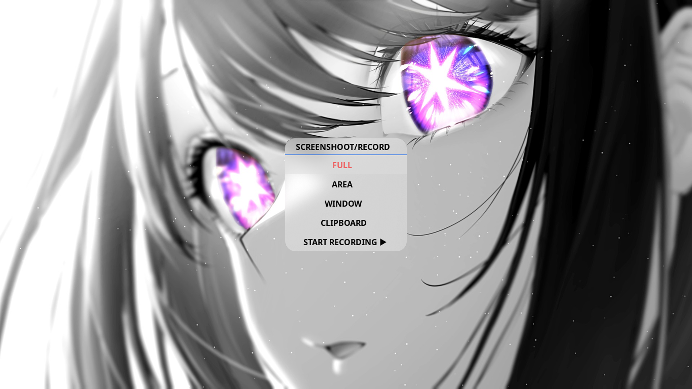
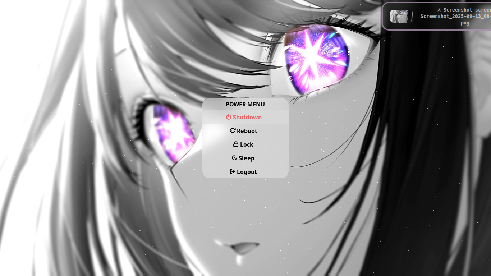
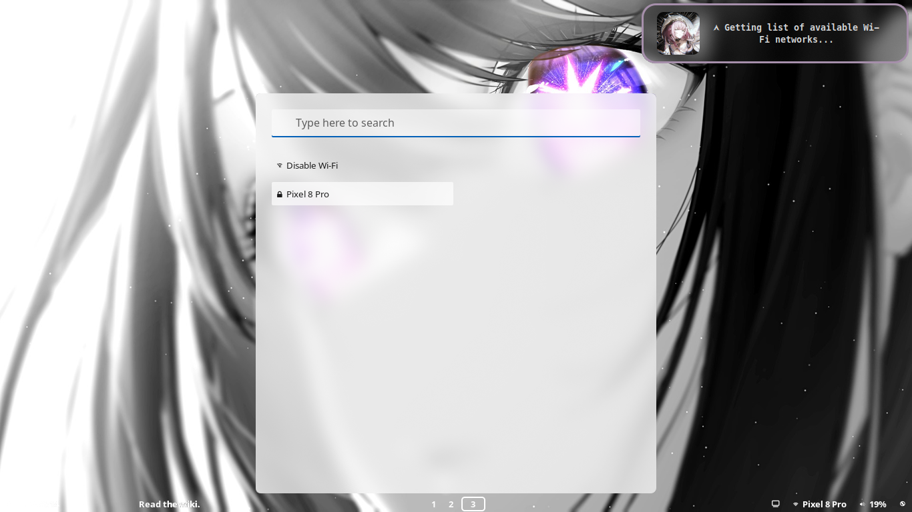

# My Hyprland Setup 🖤

Personal configs, scripts & packages to try my desktop.  
Mostly tinkering for fun, not a “ricing masterpiece.”  
Use it if you like, edit it if you see something missing.  
Happy Hyprlanding! 🚀


## 📸 Screenshots

  
  
  
  
  
  
 
   

---

## 🛠️ Install

```bash
git clone https://github.com/Asep5K/iuno-dots.git
cd iuno-dots
chmod +x install.sh
./install.sh
```

## 📑 Sources / Credits

- **rofi-wifi-menu.sh** → [ericmurphyxyz](https://github.com/ericmurphyxyz/rofi-wifi-menu/tree/master)  
- **hyprlock.conf, hypridle.conf, hypridle.sh** → [Mon4sm/monasm-dots](https://github.com/Mon4sm/monasm-dots)  
- **hyprlock.conf, emoji_launcher.sh, wallpaper_select.sh, clipboard_launcher.sh, key_hints.sh, waybar** → [ViegPhunt/Dotfiles](https://github.com/ViegPhunt/Dotfiles)  
- **rofi themes** → [newmanls/rofi-themes-collection](https://github.com/newmanls/rofi-themes-collection)  

---

## 📦 Requirements

### Core (Hyprland ecosystem)
- **hyprland** → Wayland compositor
- **hyprlock** → lockscreen
- **hypridle** → idle management (auto lock/suspend)

### Terminal
- **foot** → lightweight terminal emulator

### UI & Widgets
- **rofi-wayland** → app launcher
- **rofi-emoji** → emoji launcher
- **waybar** → status bar
- **mako** → notification daemon

### Wallpaper & Theming
- **swww** → wallpaper daemon
- **python-pywal** → generate colorscheme from wallpaper
- **mpvpaper** → video wallpaper

### CLI Utilities
- **btop** → system monitor  
- **yazi** → terminal file manager  
- **wl-copy / wl-paste** → clipboard utilities  
- **yad** → simple GUI dialogs  
- **peaclock** → customizable clock  
- **cava** → audio visualizer  

### Screenshot
- **grim** → screenshot utility  
- **grimblast** → wrapper for easier screenshots  

### Recording
- **wf-recorder** → screen recording utility

---